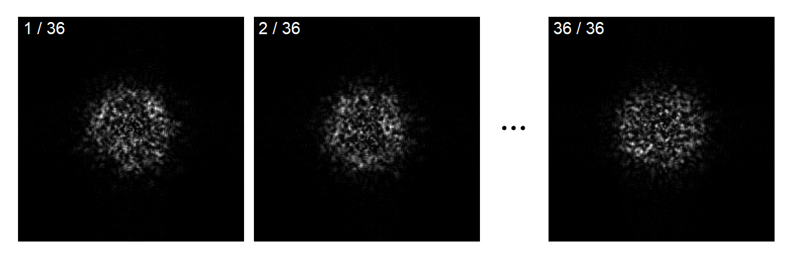
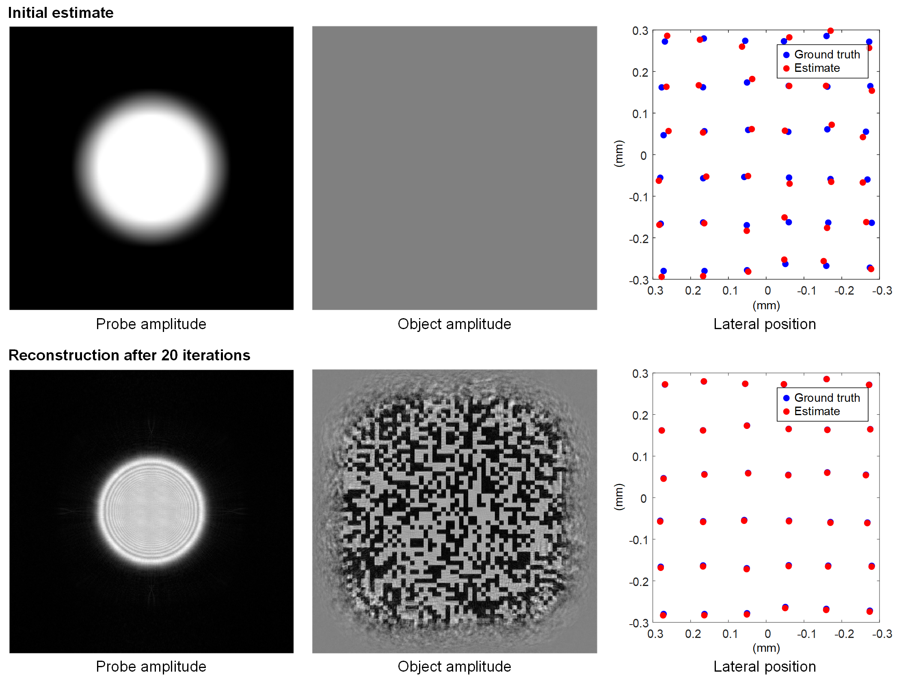
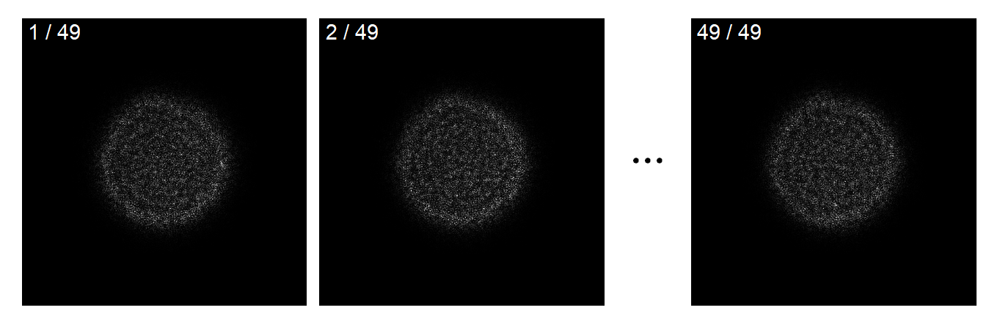
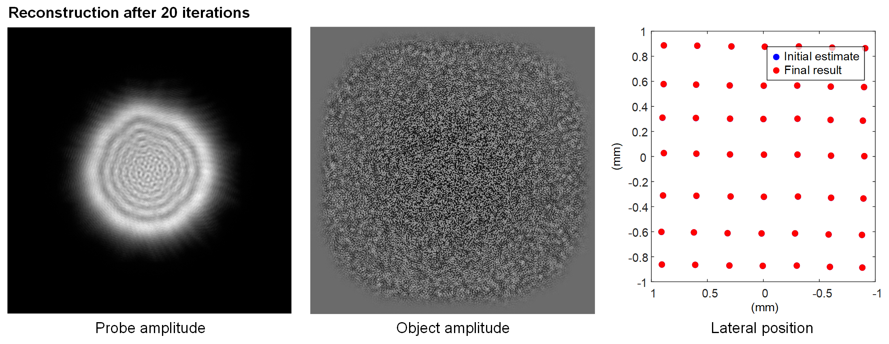

# Algorithms for ptychographic phase retrieval
**Author:** [Yunhui Gao](https://github.com/Yunhui-Gao) (gyh21@mails.tsinghua.edu.cn)

This code provides a simple MATLAB implementation of the extended ptychographical iterative engine (ePIE) with positional correction. The implementation is mostly based on the two following papers:

- [A. M. Maiden and J. M. Rodenburg, “An improved ptychographical phase retrieval algorithm for diffractive imaging,” Ultramicroscopy 109, 1256-1262 (2009).](https://doi.org/10.1016/j.ultramic.2009.05.012)
- [F. Zhang, I. Peterson, J. Vila-Comamala, A. Diaz, F. Berenguer, R. Bean, B. Chen, A. Menzel, I. K. Robinson, and J. M. Rodenburg, “Translation position determination in ptychographic coherent diffraction imaging,” Optics Express 21, 13592-13606 (2013).](https://doi.org/10.1364/OE.21.013592)

## Example with simulated data

Run `demo_sim.m` with default parameters.

Figure 1. A simulated ptychographic dataset with 36 scanning positions.

Figure 2. Reconstruction using the simulated dataset.

## Example with experimental data

Run `demo_exp.m` with default parameters.

Figure 3. An experimentally collected dataset with 49 images in the near-field regime.

Figure 4. Reconstruction using the experimental dataset.

## Requirements
Matlab 2019a or newer. Older visions may be sufficient but have not been tested.
